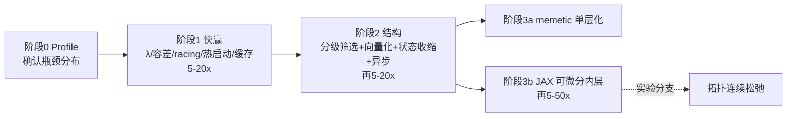

# 优化框架加速分析与改进方案

> 针对《OPTIMIZATION_FRAMEWORK.md》所述 GA(拓扑) × CMA-ES(参数) 嵌套优化框架的性能瓶颈分析与加速路线。目标：将单次完整寻优从 7 天压缩到小时级，同时不降低（通常还能提高）解质量。

## 0. 结论摘要

核心诊断：**嵌套结构的计算预算严重错配** —— 内层 CMA-ES 把每个候选拓扑（包括大量明显无望的拓扑）都优化到超高精度（λ=120 × 800 代 ≈ 9.6 万次评估/拓扑，容差 1e-11），导致 7 天预算内实际只能完整评估 ~10²–10³ 量级的拓扑，而拓扑空间大小是 2^(n(n-1)/2)。**决定解质量上限的外层拓扑搜索被饿死，算力浪费在对无望拓扑的无意义精修上。**

| 阶段 | 措施 | 预期加速 | 工作量 | 风险 |
|---|---|---|---|---|
| 阶段 1 快赢 | 修正 CMA-ES 超参 + racing 提前中止 + 热启动 + 持久缓存 | 5–20× | 1–3 天 | 低 |
| 阶段 2 结构 | 分级筛选 (successive halving) + 批量向量化仿真 + 开关状态代数收缩 + 异步并行 | 再 5–20× | 1–2 周 | 中 |
| 阶段 3 换代 | 可微分仿真 (JAX) + 梯度内层，或单层 memetic 联合进化 | 再 5–50× | 2–4 周 | 中高 |

三阶段叠加：**7 天 → 1–4 小时（阶段 1+2），→ 分钟~小时级（阶段 3）**，且同预算下可探索的拓扑数提升 2–4 个数量级，最终解通常更好。

---

## 1. 瓶颈定位：计算量的数学分析

### 1.1 嵌套乘积结构

单次完整寻优的电路求解次数：

```
N_solve = (外层新个体总数) × (内层评估数/拓扑) × (开关状态数 × 频点数)
```

按文档参数的上限计算：
- 外层：g_max = 4000 代 × ~180 新个体/代 ≈ 7.2×10⁵ 次内层 CMA-ES 运行
- 内层：λ=120 × 800 代 = 9.6×10⁴ 次代价评估/拓扑
- 每次评估：n_state × 3 频点次电路求解（设 n_state = 4–8）

→ 上限 ≈ 7.2×10⁵ × 9.6×10⁴ × 12 ≈ **8×10¹¹ 次电路求解**。即使单次求解只要 1 ms，也需要约 26 年。文档参数组合从量级上就不自洽。

### 1.2 七天预算下的实际探索量

7 天 ≈ 6×10⁵ 秒。设单次电路求解 1–10 ms（解析模型 + 小矩阵运算的典型量级），总求解预算 ≈ 6×10⁷–6×10⁸ 次。

单个拓扑的内层成本 ≈ 9.6×10⁴ 评估 × 12 求解 ≈ 1.2×10⁶ 次求解——而且 εf = εx = 1e-11 的容差在 J_target = 0.1 的工程问题上几乎永远不会提前触发收敛停止。

→ **实际能完整评估的拓扑数 ≈ 50–500 个**（即便内层平均提前停在 1/3 处，也只有 ~10³ 个）。

对比：n = 12 节点的拓扑空间有 2^66 ≈ 7×10¹⁹ 种，**探索覆盖率 ~10⁻¹⁷**。g_max = 4000 在 7 天内根本不可达——实际只能跑几代到几十代。

### 1.3 诊断结论（一切加速手段围绕这四点）

1. **预算倒挂**：>99% 算力花在把单个拓扑的参数打磨到 1e-11 精度，而设计目标只要求 J < 0.1；拓扑好坏之间的代价差异远大于参数精修最后几个数量级的改进。
2. **信息浪费**：子代拓扑与父代往往只差 1 条边，参数最优点高度相关，但内层每次都从随机点（μ0 ∈ [0.2, 0.8]）冷启动。
3. **重复计算**：同一次评估内 n_state 个开关状态各做一次全网络求解，而它们共享同一个物理网络。
4. **串行拖尾**：代同步 GA 中，最慢的一个内层运行阻塞整代推进。

---

## 2. 现有参数配置问题清单

| 参数 | 现值 | 问题 | 建议 |
|---|---|---|---|
| CMA-ES 种群 λ | 120 | Hansen 默认 λ = 4+⌊3·ln m⌋（m = 20–50 维 → λ ≈ 13–16），120 是默认值的 ~8 倍，近似线性放大内层成本；大 λ 抗多峰有价值，但与 800 代上限相乘是双重冗余 | 筛选期 λ = 14–20；仅决赛圈用大 λ 或 IPOP 重启策略 |
| εf, εx | 1e-11 | J_target = 0.1；电路模型误差与制造容差都远大于 1e-11，此容差等于禁用收敛停止 | 1e-3–1e-4；另加"连续 40 代无改进即停" |
| N_iter_max | 800 | 与 λ=120 相乘构成 9.6 万评估/拓扑的上限 | 分级预算：30 / 150 / 500（见 §3.2 第(4)条） |
| σ0 | 0.3 | 冷启动时合理；热启动时过大，会把继承来的好参数扰散掉 | 冷启动 0.3；热启动 0.05–0.1 |
| g_max | 4000 | 7 天内不可达，掩盖了真实的预算约束 | 改为显式"总仿真预算"控制与分配 |
| 去重 | 仅代内 hash | 跨代重访拓扑会整个重跑内层；同构拓扑（内部节点重标号）不判重 | 持久缓存 hash → (x*, J*)；hash 前先做 canonical(T)（文档 §5.1.2 已定义该操作，确保其真正参与 hash） |

---

## 3. 保留现架构的加速手段（按投入产出排序）

### 3.1 阶段 1：快赢项（配置级，1–3 天）

**(1) 内层"竞速"提前中止（racing）**

```
WHEN 内层 CMA-ES 已迭代 g ≥ 50 代
     且 当前局部最优 J_best_local > 3 × J_global_elite
THEN 放弃该拓扑，返回当前 J_best_local
```

无望拓扑（占多数）只花 50 × 16 ≈ 800 次评估，而非 9.6 万次。**单项即可 10–50×**（取决于无望拓扑比例，阶段 0 的 profile 会给出真实数字）。

**(2) 热启动 + Lamarck 继承**

文档 §2.2.2 已规定"子代继承父代参数"，但内层仍从随机 μ0 ∈ [0.2, 0.8] 初始化——继承的信息被直接丢弃了。改为：

```
WHEN 子代由单次变异产生（与父代仅差 1 条边）
THEN μ0 = 父代 x*，σ0 = 0.05–0.1
WHEN 子代由交叉产生
THEN μ0 = 双亲 x* 的凸组合，σ0 = 0.15
WHEN 全新随机拓扑
THEN 冷启动（μ0 随机，σ0 = 0.3）
```

参数最优点在拓扑近邻间的连续性使热启动收敛快 3–10×。

**(3) 跨代持久缓存 + 同构判重**

`canonical(T) → hash → (x*, J*, 已投入预算)` 持久化存盘。重访拓扑直接取缓存，或在既有结果基础上追加预算继续精修。1 输入 4 输出网络的内部节点可交换，同构判重能消除可观的重复评估（小规模 n 可用节点排序规范化；严格做法用图规范形算法，如 nauty）。

### 3.2 阶段 2：结构级改造（1–2 周）

**(4) 内层分级筛选（successive halving / ASHA）——本方案的核心**

把"每个拓扑一律精修到底"改为"便宜地筛所有，昂贵地修极少数"：

| 级 | 预算 | 通过比例 |
|---|---|---|
| S0 粗筛 | λ=14 × 30 代 ≈ 420 评估（热启动个体甚至可直接用继承参数+局部微扰评估） | 前 30% |
| S1 中修 | λ=16 × 150 代 | 前 25% |
| S2 精修 | IPOP-CMA-ES，≤ 500 代 | 前 5% 进入精英池 |

平均每拓扑成本从 ~9.6 万 → **约 2–4 千评估（25–50×）**。关键依据：GA 的锦标赛选择只需要个体间的**相对排序**，不需要绝对精度——粗筛排序与全预算排序的秩相关足够高即可（验证方法见 §6）。

**(5) 批量向量化仿真**

CMA-ES 每代的 λ 个候选 × n_state × 3 频点 = 数百~上千个相互独立的小矩阵问题，天然适合张量化：
- NumPy：预组装 batched ABCD/导纳矩阵，用 batched `linalg.solve`/`einsum` 一次算完整代种群
- 进阶：JAX `vmap` + GPU，吞吐再上一个数量级
- 若当前实现是 Python 循环逐个仿真，**此项独立贡献 10–100×**

**(6) 开关状态的端口代数收缩——领域特定技巧**

现状：每个开关状态各做一次全网络求解。改为：把每个开关建模为额外端口，对每个 (拓扑, 参数, 频点) **只做一次** (5+n_switch) 端口的 S 矩阵求解；每个开关状态等价于对开关端口施加已知反射系数 Γ（导通 ≈ 短路/小串阻，断开 ≈ 开路/小并容），用端口终端化公式代数收缩：

```
S_red = S_ee + S_ei · Γ · (I − S_ii·Γ)⁻¹ · S_ie
```

其中 e 为外部端口，i 为开关端口。每个状态只剩一次 n_switch × n_switch 小矩阵求逆。**加速 ≈ n_state 倍**（8 个状态即 ~8×），且各状态结果与逐状态全求解严格一致。scikit-rf 等库有现成的子网络收缩实现可参考。

**(7) 异步稳态 GA / island 并行**

代同步屏障使整代等待最慢的内层运行。改为异步稳态模式：任一 worker 完成一个拓扑评估即刻执行"插入种群 + 淘汰最差 + 产出下一个子代"。多机场景用 island model + 周期性迁移。收益：消除拖尾 + 并行度线性扩展到核数/机器数。

**(8) 结构化先验种子 + 质量-多样性档案**

6 个工作目标（1×4 等分 −6 dB、相位梯度 90°/0°/−90°；两路 −3 dB 半功分）正是**开关波束成形网络**的语义。用已知拓扑模板（Butler 矩阵、Wilkinson 树 + 开关移相支路、branch-line 级联）加随机扰动混合初始化种群，替代纯随机初始化——让 GA 从可行域边缘起步而非荒野。

多样性维护方面，用 MAP-Elites 风格档案（按边数 × 元件构成分格，每格保存该格最优个体）替代"停滞时放大 p_mut"，停滞恢复更可控、不破坏已收敛区域。

**(9) 状态-目标指派的正确性顺带修正**

现公式 J = Σ_target min_state(…) 允许多个目标选中同一个开关状态。若设计语义要求 6 个目标由**不同**状态实现，应对 6 × n_state 代价矩阵做匈牙利指派（计算量可忽略），避免优化器钻"一个状态包打所有目标"的空子。

### 3.3 阶段 1+2 合计

racing/分级筛选 (~25×) × 向量化 (~10×) × 状态收缩 (~4–8×) 各项存在重叠，即使只兑现一部分，**7 天 → 1–4 小时是保守预期**；同预算下探索拓扑数从 ~10³ 提升到 ~10⁵–10⁶。

---

## 4. 替代算法评估

### 4.1 单层 memetic 联合进化（推荐的中期形态）

把"外层 GA + 内层收敛到底"改为**一个种群同时携带 (拓扑, 参数, CMA-ES 内部状态)**：
- 每代对每个个体只做 k = 5–20 步参数精修（CMA-ES 步或梯度步），结果 Lamarck 式写回个体
- 拓扑算子照旧；参数状态随精英与子代传承
- 效果：参数优化的算力在世代间摊销，"活得久的好拓扑自然累积更多精修"——预算分配自动向优质拓扑倾斜，从机制上消除嵌套乘积

迁移成本：中（重构主循环，全部现有算子与代价函数可复用）。与 §3 各项完全兼容、可叠加。

### 4.2 代理模型辅助进化（SAEA）

用持久缓存积累的 (拓扑特征, J*) 数据训练预测器（GBDT 起步即可；进阶用 GNN 直接输入邻接矩阵），对 GA 新生子代先预测、只让预测前 ~20% 进入真实内层评估。**已有的 7 天运行日志就是现成的训练集。** 外层有效搜索力提升 2–5×。风险：预测器偏差会系统性排除某类拓扑——保留 ~10% 随机直通配额对冲。

### 4.3 可微分仿真 + 梯度内层（上限最高；前提：仿真是自研解析模型）

代价链：参数 → 微带线解析模型（Hammerstad-Jensen 等）→ ABCD/Y 级联或 MNA 求解 → S 参数 → dB/相位 → hinge 损失 → max/min/Σ，全程可微（max 用 logsumexp 平滑并退火、ReLU hinge 用 softplus、min_state 可保留硬选择）。用 JAX 重写仿真核（可参考 [SAX](https://github.com/gdsfactory/sax)：S 参数频域电路仿真 + 自动微分 + XLA，出自光子学但 S 参数形式与微波通用），则：
- 内层从 ~10⁴–10⁵ 次无梯度评估 → **32 路 multi-start × ~200 步 L-BFGS/Adam ≈ 10³ 次带梯度评估**，且全部可 GPU 批量化
- 预期内层再提速 10–50×，且常能找到更好的局部最优
- 风险：重写工作量 2–4 周；hinge 死区与 max 的不光滑需要平滑退火处理；多峰问题仍需 multi-start（可保留短程 CMA-ES 对决赛圈做交叉验证）

### 4.4 拓扑连续松弛（激进选项，可消除外层 GA）

把二进制边变量松弛为 w_ij ∈ [0,1]（物理对应：边上串联可变导纳/开关电阻），加二值化压力项 Σ w(1−w) 或 Gumbel-softmax 退火，与参数**一起做单次梯度优化**，收敛后阈值化回 {0,1} 并精修。相当于 DARTS / 密度法拓扑优化在电路设计中的对应物。潜在收益：整个组合搜索坍缩为一次连续优化（分钟级）。风险高：松弛最优与离散最优可能存在 gap，需多次退火重启；建议作为 4.3 完成后的实验分支，与 GA 路线并行互为兜底。

### 4.5 按"单次评估代价"分支的选择

| 情形 | 单次评估 | 推荐路线 |
|---|---|---|
| (a) 自研解析电路模型 | ~ms 级，代码可改 | §3 全套 + 4.3 可微分化（首选）→ 4.4 实验分支 |
| (b) 外部电路/EM 仿真器黑盒 | 秒~分钟级 | 多保真：粗解析模型驱动搜索 + 细模型定期校正（space mapping）；参数层改用 BO（TuRBO/SMAC3，每拓扑预算 100–500 次评估）；§3.1/3.2 的筛选与缓存策略同样适用 |

由"7 天 ÷ 文档评估量级"反推，当前实现大概率属于情形 (a)（毫秒级解析模型）——否则 7 天连几个拓扑的 9.6 万次评估都跑不完。若实际是情形 (b)，请按上表切换推荐路线。

### 4.6 不推荐的方向

- **混合变量贝叶斯优化统管拓扑+参数**：GP 在几十维二进制 + 几十维连续、且单点评估仅毫秒级的场景下，代理建模开销反而成为新瓶颈；BO 的样本效率优势只在"评估昂贵"时兑现。
- **强化学习生成拓扑**：训练成本远超单任务收益，除非需要跨大量不同设计任务复用生成策略。

---

## 5. 实施路线图



**阶段 0（半天，最先做）**：实测并记录——单次电路求解耗时、内层实际平均迭代数与提前停止率、按 racing 规则可判无望的拓扑比例、开关状态数、拓扑重访/同构命中率。这些数字决定各项措施的真实收益排序（先测量，再优化）。

---

## 6. 验证方法

1. **固定基准集**：抽取 20–50 个历史拓扑（好/中/差分层抽样），对比改造前后内层找到的 J*。验收标准：分级筛选给出的排序与全预算排序的 Spearman 秩相关 > 0.9；精修级 J* 相对差异 < 2%。
2. **状态收缩正确性**：对同一 (拓扑, 参数, 频点)，端口代数收缩结果与逐状态全求解逐元素比对（|ΔS| < 1e-10）。
3. **同预算对照实验**：给新旧框架相同墙钟时间（如 6 小时），比较全局最优 J 与已探索拓扑数。
4. **可微分版一致性**：JAX 前向计算与原仿真数值一致（rtol ≤ 1e-6）后，才启用梯度优化路径。
