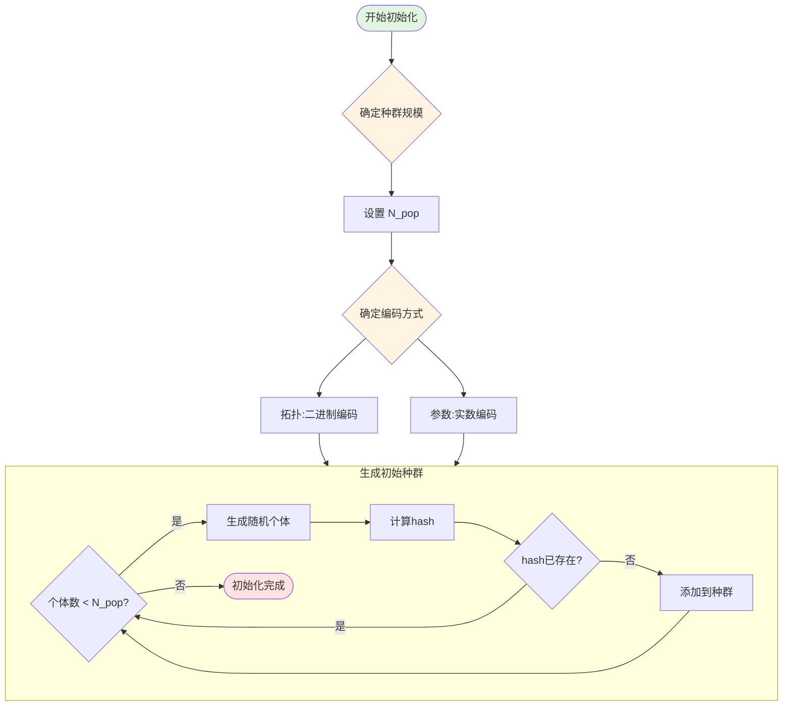
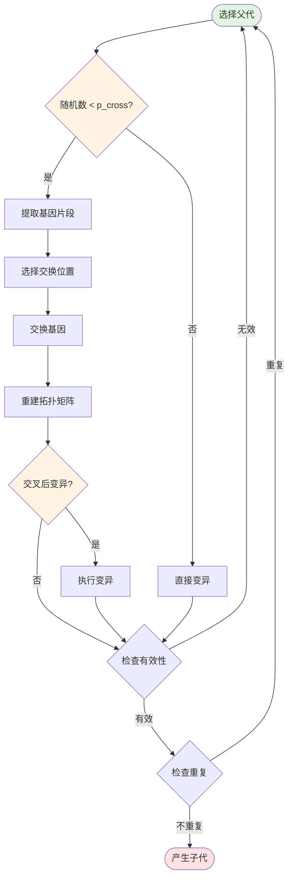
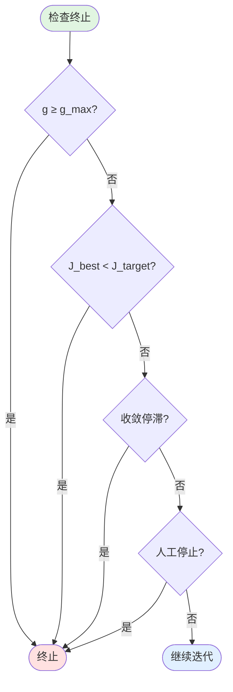
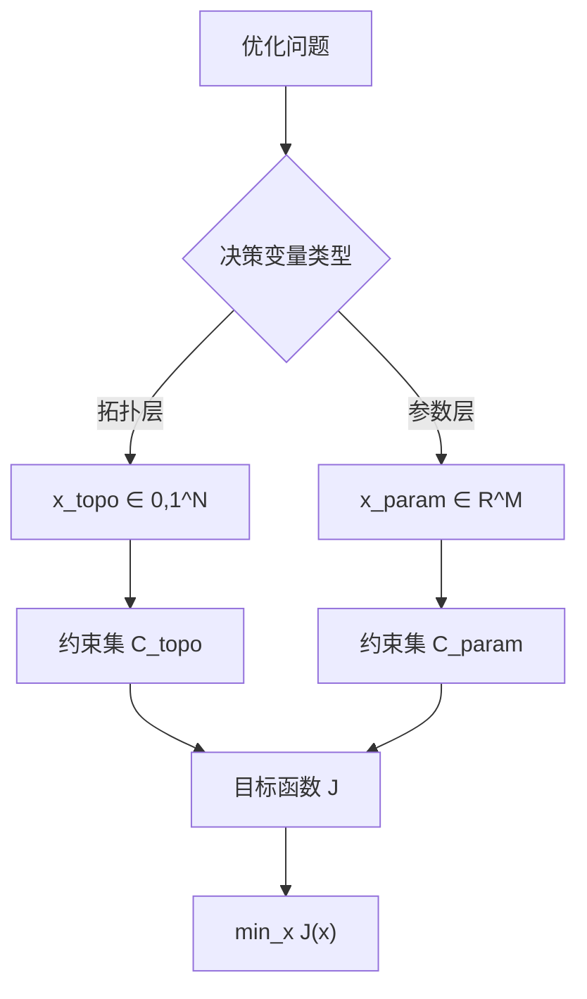

# 优化算法决策框架文档

## 术语定义

本节定义文档中使用的核心术语，采用半抽象化表示。

**决策变量 (Decision Variables)**
:: 优化的输入变量集合，分为拓扑变量 $x_{topo}$ 和参数变量 $x_{param}$。

**目标函数 (Objective Function)**
:: 多目标加权和函数 $J(x)$， quantify 优化目标与期望结果的偏差。

**约束集 (Constraint Set)**
:: 决策变量可行域的定义，包括拓扑约束 $C_{topo}$ 和参数约束 $C_{param}$。

**决策点 (Decision Point)**
:: 算法流程中的判断节点，使用 WHEN/THEN 结构描述触发条件和执行动作。

**代价函数 (Cost Function)**
:: 目标函数的具体实现形式，包含多个目标分量的加权和。

---

## 第 2 章：遗传算法决策流程

本章详细阐述遗传算法在拓扑优化层中的决策流程，使用 WHEN/THEN 结构描述各阶段的决策点。

### 2.1 初始化阶段决策

**WHEN** 启动优化算法  
**THEN** 执行种群初始化，决策以下参数：

1. **种群规模决策**  
   **WHEN** 确定种群规模  
   **THEN** 设置 $N_{pop}$，考虑以下因素：
   - 拓扑空间复杂度
   - 计算资源限制
   - 收敛速度要求

2. **编码方式决策**  
   **WHEN** 确定编码方式  
   **THEN** 选择编码策略：
   - 拓扑变量：二进制编码 $x_{topo} \in \{0,1\}^N$
   - 参数变量：实数编码 $x_{param} \in \mathbb{R}^M$

3. **初始种群生成决策**  
   **WHEN** 生成第0代种群  
   **THEN** 执行如下循环：
   ```
   WHILE 种群规模 < N_pop:
       生成随机个体
       计算冗余矩阵hash
       IF hash不存在于当前种群:
           添加个体到种群
           记录hash
   ```

**初始化决策流程图：**



### 2.2 迭代过程决策

#### 2.2.1 选择决策

**WHEN** 当前代数 $g < g_{max}$ 且未达到终止条件  
**THEN** 执行种群选择，决策如下：

1. **精英保留决策**  
   **WHEN** 选择策略确定  
   **THEN** 保留前 $N_{elite}$ 个最优个体：
   ```
   IF 使用精英策略:
       保留 cost 最小的前 N_{elite} 个个体
       精英个体直接进入下一代，不参与变异
   ```

2. **锦标赛选择决策**  
   **WHEN** 构建配对池  
   **THEN** 执行锦标赛选择：
   ```
   FOR i in range(N_pop // 2 - N_elite):
       随机选择 t 个个体（t为锦标赛大小）
       选择其中 cost 最小的个体进入配对池
   ```

**选择压力参数：**  
锦标赛大小 $t$ 越大，选择压力越强，收敛越快但多样性降低。

**当** $t = 5$，种群规模 $N_{pop} = 200$  
**则** 选择压力适中，平衡收敛与探索。

#### 2.2.2 交叉决策

**WHEN** 随机数 $r < p_{cross}$  
**THEN** 执行拓扑交叉操作：

1. **交叉算子选择决策**  
   **WHEN** 确定交叉方式  
   **THEN** 选择：
   - 单点交叉：交换拓扑矩阵的某一行
   - 基因交换：交换外部/内部连接基因片段

2. **交叉执行决策**  
   **WHEN** 执行交叉  
   **THEN**：
   ```
   提取父代拓扑基因片段
   随机选择交换位置
   交换基因片段
   重建完整拓扑矩阵（保持对称性）
   子代继承父代参数（不交叉参数）
   ```

3. **交叉后变异决策**  
   **WHEN** 随机数 $r < p_{mut\_after\_cross}$  
   **THEN** 对交叉后的子代执行变异操作

**交叉操作流程图：**



#### 2.2.3 变异决策

**WHEN** 随机数 $r < p_{mut}$ 或交叉后变异触发  
**THEN** 执行拓扑变异，决策变异类型：

1. **添加连接变异**  
   **WHEN** 变异类型 = 添加连接  
   **THEN**：
   ```
   随机选择未连接位置 (x_topo[i,j] = 0)
   设置连接 (x_topo[i,j] = 1, x_topo[j,i] = 1)
   ```

2. **删除连接变异**  
   **WHEN** 变异类型 = 删除连接  
   **THEN**：
   ```
   找到已连接位置 (x_topo[i,j] = 1)
   随机选择一个连接
   删除连接 (x_topo[i,j] = 0, x_topo[j,i] = 0)
   ```

3. **移动连接变异**  
   **WHEN** 变异类型 = 移动连接  
   **THEN** 执行删除+添加操作

4. **随机生成变异**  
   **WHEN** 变异类型 = 随机生成  
   **THEN** 生成全新的随机拓扑

**多样性增强决策：**

```
WHEN 种群多样性度量 < 阈值
THEN 增大变异概率或增加随机个体数：
  - p_mut = p_mut × diversity_factor
  - 或引入 N_random 个随机个体
```

**当** 连续 $N_{stall}$ 代最优个体未改进  
**则** 触发多样性增强机制。

#### 2.2.4 精英保留决策

**WHEN** 使用精英策略  
**THEN**：
1. 对当前种群按 cost 升序排序
2. 保留前 $N_{elite}$ 个个体直接进入下一代
3. 精英个体存档以便分析

**参数配置：** $N_{elite} = 0.1 \times N_{pop}$（典型值）

### 2.3 终止条件决策

**WHEN** 满足以下任一条件  
**THEN** 终止遗传算法迭代：

| 终止条件 | 数学表示 | 典型值 |
|---------|---------|--------|
| 代数限制 | $g \geq g_{max}$ | 4000 |
| 成本阈值 | $J_{best} < J_{target}$ | 0.1 |
| 收敛停滞 | $J_{best}(g) - J_{best}(g-N_{stall}) < \epsilon$ | - |
| 人工干预 | STOP文件存在 | - |

**终止决策流程：**



### 2.4 种群更新决策

**WHEN** 完成遗传操作  
**THEN** 执行种群更新三阶段：

#### 阶段 A：精英保留
- 加入前 $N_{elite}$ 个最优个体
- 执行去重检查

#### 阶段 B：繁殖子代
- 目标数量：$N_{offspring} = N_{pop} - N_{elite} - N_{random}$
- 通过交叉/变异生成子代
- 执行去重检查
- 补充随机个体至 $N_{random}$ 个

#### 阶段 C：评估与更新
- 并行评估新种群
- 按个体ID排序
- 更新种群记录

**种群组成：**
```
新种群 = 精英个体 + 繁殖子代 + 随机个体
       = N_elite   + N_offspring + N_random
       = N_pop
```

### 2.5 关键参数总结

| 参数符号 | 含义 | 典型值 |
|---------|------|--------|
| $N_{pop}$ | 种群规模 | 200 |
| $N_{elite}$ | 精英保留数量 | 20 |
| $t$ | 锦标赛大小 | 5 |
| $p_{cross}$ | 交叉概率 | 0.7 |
| $p_{mut}$ | 变异概率 | 0.3 |
| $p_{topo}$ | 拓扑操作概率 | 0.7 |
| $g_{max}$ | 最大代数 | 4000 |
| $J_{target}$ | 目标成本 | 0.1 |

---


- [第 1 章：优化目标与约束](#第-1-章优化目标与约束)
- [第 2 章：遗传算法决策流程](#第-2-章遗传算法决策流程)
- [第 3 章：参数优化决策流程（CMA-ES）](#第-3-章参数优化决策流程cma-es)
- [第 4 章：代价函数决策流程](#第-4-章代价函数决策流程)
- [第 5 章：关键数据抽象](#第-5-章关键数据抽象)

---

## 第 1 章：优化目标与约束

本章定义优化问题的数学形式，包括目标函数和约束条件。

### 1.1 目标函数定义

**数学形式**

优化问题的目标是找到决策变量 $x$，使得目标函数 $J(x)$ 最小化：

$$
\min_{x} J(x) = \min_{x} \sum_{i=1}^{m} w_i \cdot f_i(x)
$$

其中：
- $x = [x_{topo}, x_{param}]$：决策变量向量
  - $x_{topo} \in \{0,1\}^N$：拓扑决策变量（二进制编码）
  - $x_{param} \in \mathbb{R}^M$：参数决策变量（实数编码）
- $f_i(x)$：第 $i$ 个目标分量函数
- $w_i$：第 $i$ 个目标的权重系数
- $m$：目标分量总数

**决策变量空间**

优化在两层嵌套空间中进行：



**决策变量含义**

| 变量类型 | 编码方式 | 取值空间 | 优化算法 |
|---------|---------|---------|---------|
| 拓扑变量 $x_{topo}$ | 二进制 | $\{0,1\}^N$ | 遗传算法 (GA) |
| 参数变量 $x_{param}$ | 实数 | $\mathbb{R}^M$ | CMA-ES |

**优化流程架构**

两层优化采用嵌套结构：

```
外层循环（遗传算法）：
    生成/进化拓扑变量 x_topo
    ↓
    内层循环（CMA-ES）：
        针对固定 x_topo，优化参数 x_param
        min_x_param J(x_topo, x_param)
    ↓
    返回最优参数对应的目标值
```

### 1.2 约束条件集合

约束条件保证解的可行性和有效性，分为拓扑约束和参数约束。

#### 1.2.1 拓扑约束

拓扑约束定义拓扑变量的可行域 $C_{topo}$：

**对称性约束**

$$
x_{topo}[i,j] = x_{topo}[j,i], \quad \forall i, j
$$

**无自环约束**

$$
x_{topo}[i,i] = 0, \quad \forall i
$$

**连接性约束**

拓扑的最小生成树必须包含所有必要节点，确保无孤立节点：

$$
\text{rank}(A_{topo}) \geq n_{nodes} - 1
$$

其中 $A_{topo}$ 为拓扑邻接矩阵。

**表示约束**

为了消除拓扑编码冗余，使用上三角存储：

$$
x_{topo}^{stored} = \{x_{topo}[i,j] \mid i < j\}
$$

#### 1.2.2 参数约束

参数约束定义参数变量的可行域 $C_{param}$：

**取值范围约束**

$$
x_{param}[i] \in [x_{min}[i], x_{max}[i]], \quad \forall i
$$

参数范围由元件库定义（如微带线长度、宽度范围）。

**物理意义约束**

- 线性尺度参数：$x > 0$（如长度、宽度）
- 角度参数：$x \in [0^\circ, 360^\circ]$
- 无量纲参数：$x \in \mathbb{R}$

#### 1.2.3 性能约束（可选）

当存在最低性能要求时，添加不等式约束：

$$
|S_{21}| \geq S_{21}^{min}, \quad |S_{11}| \leq S_{11}^{max}
$$

这类约束通常通过惩罚项方式处理。

### 1.3 约束决策流程

```
WHEN 决策变量不满足约束
THEN 执行约束处理：
  - IF 违反拓扑约束
    THEN 拒绝该个体或修复拓扑
  - IF 违反参数约束（越界）
    THEN 投影到可行域边界
  - IF 违反性能约束
    THEN 添加惩罚项到目标函数
```

**约束违反惩罚机制**

$$
J_{penalty}(x) = J(x) + \lambda \cdot P(x)
$$

其中：
- $P(x)$：约束违反程度度量
- $\lambda$：惩罚系数（通常设为较大值）

---


## 第 3 章：参数优化决策流程（CMA-ES）

本章阐述针对固定拓扑的参数优化决策流程，采用 CMA-ES（Covariance Matrix Adaptation Evolution Strategy）算法。

### 3.1 初始化决策

**WHEN** 遗传算法完成拓扑生成 或 参数优化触发  
**THEN** 初始化 CMA-ES 优化器：

#### 3.1.1 参数空间映射决策

**WHEN** 确定参数空间维度  
**THEN** 定义参数向量：


x_{param} = [W_1, L_1, W_2, L_2, ..., L_{ind}, C_{cap}, ...]


维度计算：

\mathrm{dim} = 2 \times N_{tlines} + 1 \times N_{inductors} + 1 \times N_{capacitors}


**WHEN** 参数跨越多个数量级  
**THEN** 选择映射策略：

| 参数类型 | 映射方式 | 公式 |
|---------|---------|------|
| 微带线尺寸 (W, L) | 线性映射 | \{phys} = x_{min} + x_{norm} \cdot (x_{max} - x_{min})$ |
| 电感/电容值 | 对数映射 | \{phys} = 10^{\log_{10}(x_{min}) + x_{norm} \cdot \Delta\log}$ |

#### 3.1.2 CMA-ES 初始化参数

**WHEN** 创建 CMA-ES 实例  
**THEN** 设置以下参数：

| 参数符号 | 含义 | 典型值 |
|---------|------|--------|
| $\mu_0$ | 初始均值向量 | 随机 $[0.2, 0.8]$ |
| $\sigma_0$ | 初始步长 | 0.3 |
| $N_{pop}$ | 种群规模 | 120 |
| $N_{iter}^{max}$ | 最大迭代次数 | 800 |
| $\epsilon_f$ | 函数值容差 | $10^{-11}$ |
| $\epsilon_x$ | 坐标容差 | $10^{-11}$ |

---

### 3.2 采样与评估决策

**WHEN** 需要生成新一代候选解  
**THEN** 从多元正态分布采样：


x_k \sim \mathcal{N}(\mu, \sigma^2 C), \quad k = 1, 2, ..., N_{pop}


**WHEN** 获得 $N_{pop}$ 个候选解  
**THEN** 批量评估：
1. 反归一化：将归一化参数映射到物理参数
2. 执行仿真：对于固定拓扑 $x_{topo}$，计算性能指标
3. 计算代价：$J_k = J(x_{topo}, x_k^{phys})$

---

### 3.3 终止条件决策

**WHEN** 满足以下任一条件  
**THEN** 终止参数优化：

| 终止条件 | 数学表示 |
|---------|---------|
| 步长过小 | $\sigma < \sigma_{min}$ |
| 函数值收敛 | $|J^{(g)} - J^{(g-1)}| < \epsilon_f$ |
| 迭代上限 | $g \geq N_{iter}^{max}$ |

---


## 第 4 章：代价函数决策流程

本章详细阐述代价函数的计算流程，**保留代价函数的具体结构**，仅抽象化项目背景。

### 4.1 目标向量构建

**WHEN** 需要评估个体性能  
**THEN** 构建目标向量：

#### 4.1.1 目标分量定义

对于 1 输入 4 输出的微波网络，定义 6 种工作目标：

| 目标编号 | 模式 | 幅度目标 | 相位差目标 |
|---------|------|----------|------------|
| T0-T2 | 全功分 | 四端口 -6 dB | 90°, 0°, -90° |
| T3-T5 | 半功分 | P3,P4 各 -3 dB | 90°, 0°, -90° |

#### 4.1.2 S参数提取

从仿真结果提取关心的传输系数：

`
S_21 = P1端口传输系数
S_31 = P2端口传输系数  
S_41 = P3端口传输系数
S_51 = P4端口传输系数
`

计算幅度和相位：
`
S_amp_db = 20·log10|S|
S_phase_deg = angle(S) · 180/π
`

---

### 4.2 权重分配决策

**WHEN** 构建代价函数  
**THEN** 采用固定权重策略：

#### 4.2.1 代价函数完整公式

总代价函数为多目标加权和：


J = \sum_{target=0}^{5} \min_{state} \left( \max_{freq} J_{target}(freq, state) \right)


其中：
- 外层对 6 个目标求和
- 中层对开关状态择优（取最小）
- 内层对频点取最差（取最大，鲁棒性设计）

#### 4.2.2 单目标代价公式

对于每个目标、频点、开关状态，代价包括幅度代价和相位代价：


J_{target} = J_{amp} + J_{phase}


**幅度代价：**

激活口代价：
`
amp_err = |S_amp_db - target_amp_db|
amp_loss_active = ReLU(amp_err - 1.0) × 15.0 + ReLU(amp_err - 3.0)² × 20.0
`

隔离度代价：
`
iso_err = ReLU(S_amp_db - (-25))
amp_loss_iso = (iso_err × 35.0 + iso_err² × 5.0)
`

**相位代价：**

相位差计算：
`
phase_diff = angle(e^{j·(phase[i+1] - phase[i])})
phase_err = |phase_diff_deg - target_phase_diff|
phase_loss = ReLU(phase_err - 12.0) × 1.0 + ReLU(phase_err - 30.0)^{1.5} × 5.0
`

**权重系数表：**

| 权重项 | 值 | 用途 |
|-------|-----|------|
| 激活口基础 | 15.0 | 幅度超1dB惩罚 |
| 激活口严重 | 20.0 | 幅度超3dB平方惩罚 |
| 隔离度基础 | 35.0 | 强制管死非激活口 |
| 隔离度平方 | 5.0 | 隔离度超差追加 |
| 相位基础 | 1.0 | 相位超12°惩罚 |
| 相位严重 | 5.0 | 相位超30°追加 |

---

### 4.3 规范化处理决策

**WHEN** 目标分量量纲不一致  
**THEN** 不执行规范化（代价函数已在相同单位 dB 和角度下统一）

**决策依据：**
- 幅度：统一使用 dB 单位
- 相位：统一使用角度单位
- 无需额外规范化处理

---

### 4.4 惩罚项计算决策

**WHEN** 存在约束违反  
**THEN** 通过 ReLU 函数自动添加惩罚：

**ReLU 惩罚特性：**
`
ReLU(x) = max(0, x)
`

- 当误差在容忍范围内：ReLU(负值) = 0，无惩罚
- 当误差超出容忍范围：ReLU(正值) = 正值，施加惩罚

**分段惩罚策略：**
`
IF amp_err > 3.0:
    平方惩罚（严重超差）
ELIF amp_err > 1.0:
    线性惩罚（轻微超差）
ELSE:
    无惩罚
`

---

### 4.5 决策流程图

`mermaid
flowchart TD
    Start([开始代价计算]) --> Extract[提取 S参数<br/>S21, S31, S41, S51]
    Extract --> Calc[计算幅度 dB 和相位]
    
    Calc --> AmpLoss[计算幅度代价<br/>激活口 + 隔离度]
    AmpLoss --> PhaseLoss[计算相位代价<br/>相位差误差]
    
    PhaseLoss --> WorstFreq[频点最差抑制<br/>max over 3 freqs]
    WorstFreq --> BestState[开关状态择优<br/>min over States]
    BestState --> SumTarget[对 6 目标求和]
    
    SumTotal --> End([返回总代价])
    
    style Start fill:#e1f5e1
    style End fill:#ffe1e1
    style AmpLoss fill:#e1f0ff
    style PhaseLoss fill:#fff4e1
`

---

## 第 5 章：关键数据抽象

本章抽象化关键数据结构，便于通用化理解。

### 5.1 拓扑表示抽象

#### 5.1.1 数学定义

**表示形式：** 二进制矩阵 $T \in \{0,1\}^{n \times n}$

**约束条件：**
- 对称性：$T = T^T$
- 无自环：$T_{ii} = 0, \forall i$
- 上三角存储：$T_{stored} = \{T_{ij} \mid i < j\}$

#### 5.1.2 操作集

| 操作 | 含义 | 输出 |
|-----|------|------|
| hash(T) | 生成唯一标识 | 整数 |
| crossover(T_1, T_2) | 拓扑交叉 | 新拓扑 |
| mutate(T) | 拓扑变异 | 新拓扑 |
| canonical(T) | 冗余修正 | 规范拓扑 |

---

### 5.2 参数空间抽象

#### 5.2.1 数学定义

**参数向量：** $x \in \mathbb{R}^m$

**参数范围：** $x \in [x_{min}, x_{max}]$

**维度计算：**
`
m = 2 × N_tlines + 1 × N_inductors + 1 × N_capacitors
`

#### 5.2.2 操作集

| 操作 | 含义 |
|-----|------|
| sample(bounds) | 采样参数 |
| project(x, bounds) | 投影到可行域 |
| 
ormalize(x) | 归一化到 [0,1] |
| denormalize(x_norm) | 反归一化到物理值 |

---

### 5.3 性能指标抽象

#### 5.3.1 数学定义

**S参数矩阵：** $S \in \mathbb{C}^{p \times p}$

**目标向量：** $f \in \mathbb{R}^k$（k个目标分量）

#### 5.3.2 操作集

| 操作 | 含义 |
|-----|------|
| simulate(T, x) | 执行仿真 |
| extract_S(S, ports) | 提取关心的传输系数 |
| calc_cost(S, targets) | 计算代价 |

---

### 5.4 数据抽象总结

| 抽象名称 | 数学表示 | 空间维度 | 操作数 |
|---------|---------|---------|--------|
| 拓扑 | $T \in \{0,1\}^{n \times n}$ | $n^2/2$ | 4 |
| 参数 | $x \in \mathbb{R}^m$ | m | 4 |
| 性能 | $S \in \mathbb{C}^{p \times p}$ | $p^2$ | 3 |

---

